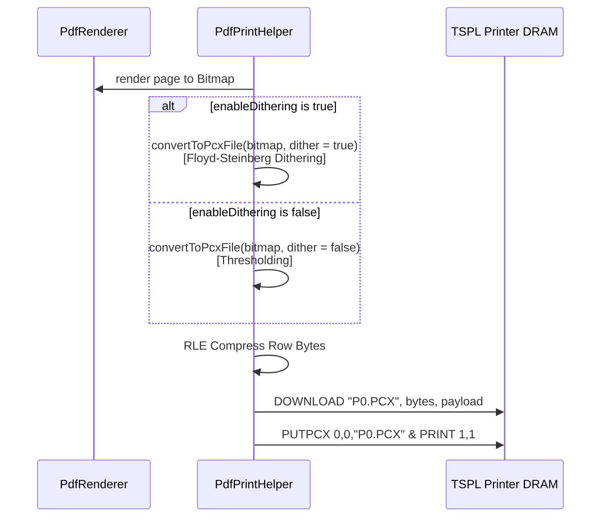

## Context

The `dramBatch` strategy renders PDF pages and uploads them as PCX files into printer DRAM memory prior to print execution. Currently, `printDramBatch` invokes `convertToPcxFile(pageBitmap)`, which uses hard thresholding (`gray >= 128`) and ignores the `enableDithering` option. In contrast, `pageByPage` calls `convertToMonochrome()`, which applies Floyd-Steinberg error diffusion dithering. This difference makes `dramBatch` tickets appear blurry, pixelated, or soft compared to `pageByPage`.

## Goals / Non-Goals

**Goals:**
- Implement Floyd-Steinberg dithering in `convertToPcxFile()` when `enableDithering` is `true`.
- Pass `enableDithering` from `printDramBatch` to `convertToPcxFile`.
- Ensure PCX scanline byte alignment (`bytesPerLine`) matches image boundaries without unexpected padding artifacts.
- Make `dramBatch` output visually identical to `pageByPage` output.

**Non-Goals:**
- Changing TSPL `DOWNLOAD` or `PUTPCX` syntax.
- Modifying `unifiedRoll` or `pageByPage` helper functions.

## Decisions

### Decision 1: Support Floyd-Steinberg Dithering in `convertToPcxFile`
We will update `convertToPcxFile` to `convertToPcxFile(bitmap: Bitmap, dither: Boolean): ByteArray`.
- When `dither` is `true`: Calculate Floyd-Steinberg error diffusion across RGB grayscale values before assigning 1-bit pixels (White = 1, Black = 0).
- When `dither` is `false`: Use simple thresholding (`gray >= 128`).
- Map black pixels to `0` and white pixels to `1` in the 1-bit PCX color palette.

*Alternatives Considered:*
- *Converting PCX to raw BITMAP*: `PUTPCX` is fast and reliable for DRAM batching on TSPL hardware. Adding dithering directly to PCX encoding achieves identical image crispness without introducing buffer overflows on thermal printer DRAM.

### Decision 2: PCX Encoding Flow Sequence

## Risks / Trade-offs

- [Floyd-Steinberg CPU Overhead] → Negligible on modern Android hardware (takes < 5ms per page bitmap).
- [RLE Compression ratio change] → Dithered images have more alternating 1/0 bits, slightly increasing PCX binary payload size. Mitigation: PCX RLE handles 1-bit scanlines efficiently and transfers fast over Bluetooth SPP.
